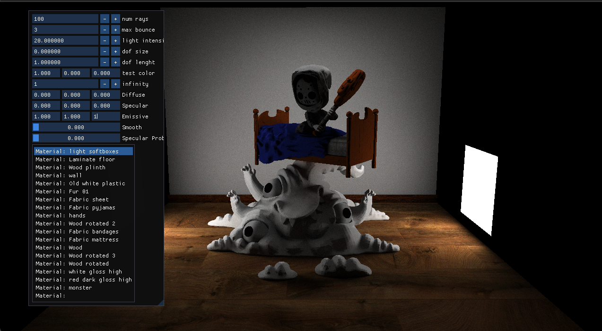

# Golmon Engine

When starting the app, you're not gonna see anything. 
Because you need to create the light source.
on the left you can see a menu whith all the differents materials of the scene.
you need to set the emissive value of the material of your choice to be non zero.
If you look at the name of the materials, you should find the one that represents the light.
But you can illuminate the scene with the floor if you would like lol.

the dof size and length are parameters to controll the depth of field. 

if you want to load a different scene, you need to change the code in the file Core.cpp line 175 with the method scene.load_scene()

# Compilation

This project was made in C++ with Vulkan, you will need to install Vulkan on your device. all the others libraries are included in the project.

This project use MSVC as the compiler, you can Use Visual Studio 2022 to compile it. Im providing the VS Solution in the repo.

if the project doesnt start because the gpu chosen was not the good one, you can swith the value of Vk::device.set_gpu(0) (from 0 to 1 or from 1 to 0) in the file Core.cpp line 142
